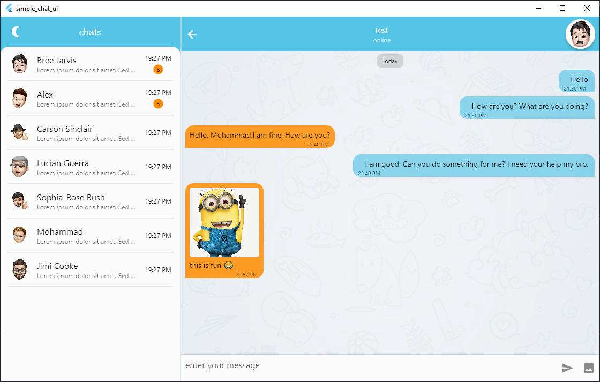

# Simple Chat UI

This template is a simple chat ui build with flutter. 

If you are interested with this repository feel free to fork this repository and send pull request to have better world together

## Known Issues
- there is so many bug in web and desktop mode, they will be fix as soon as possible

## TODO
- [x] dark mode
- [x] support image
- [ ] support gif, video, ...
- [x] web mode
- [x] desktop mode

## Screenshots

  

### Dark Mode

  

### Desktop

