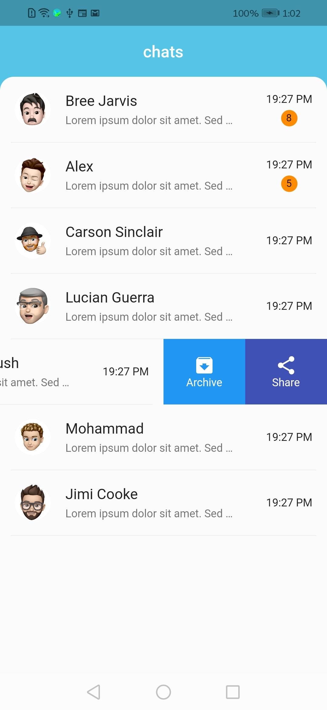
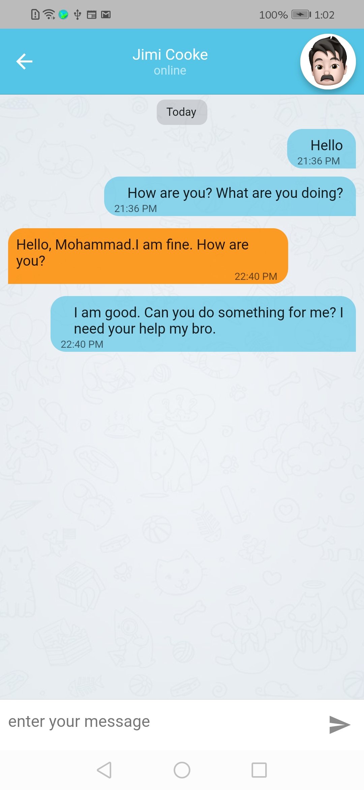
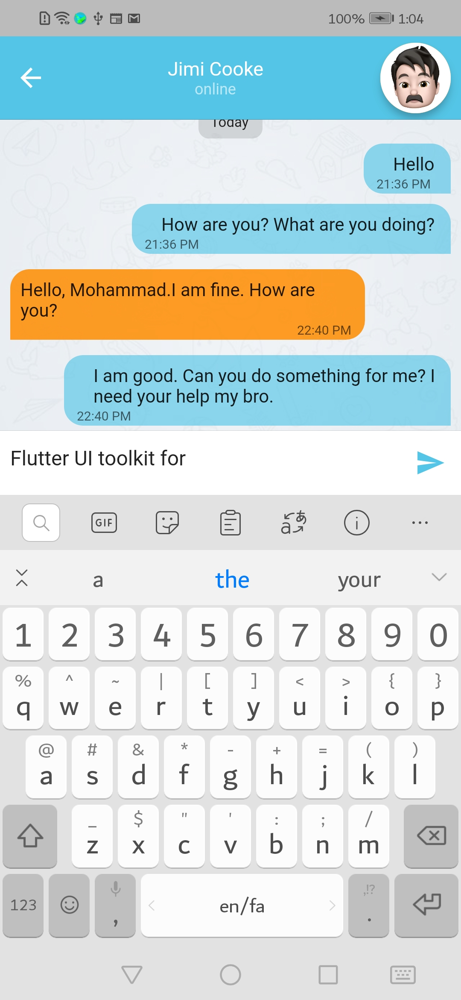
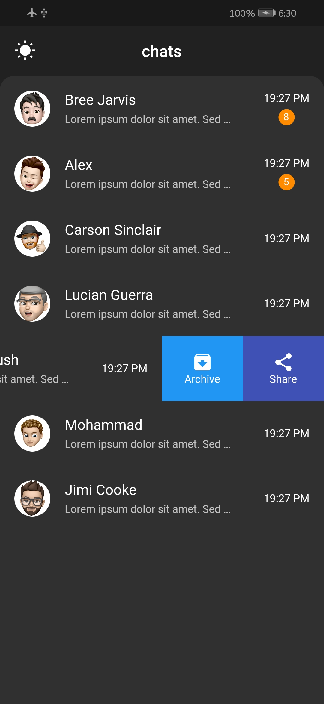
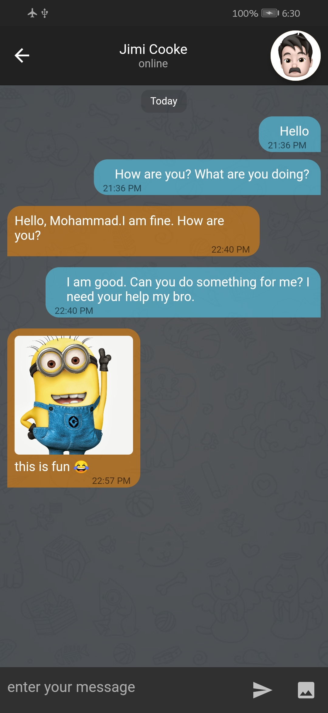
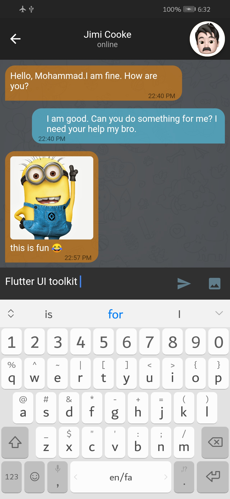

# Simple Chat UI

This template is a simple chat ui build with flutter ui toolkit. 

## TODO
- [x] dark mode
- [x] support image
- [ ] support gif, video, ...
- [ ] web mode
- [ ] desktop mode

## Screenshots

  

### Dark Mode

  